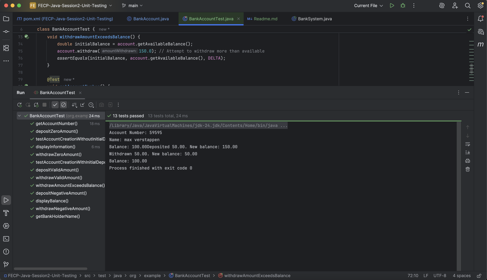

# General Malit
## Lab 2 - Unit Testing
Screenshot of Test Coverage:

Note that the tests displayInformation and displayBalance do not really do anything, however, i have no idea how to check for the output since it outputs a string directly onto the console.

Hopefully i will be able to learn about the best practice checking console string outputs.

